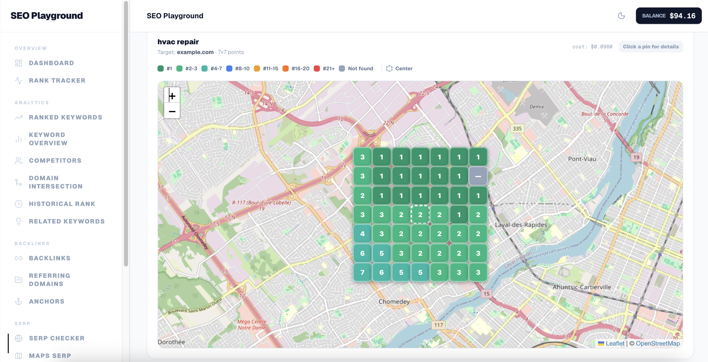
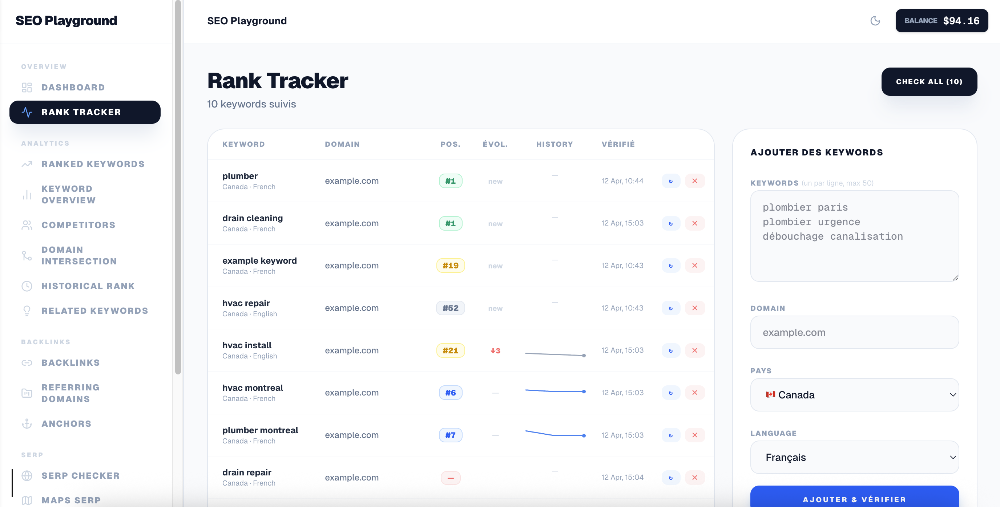

# SEO Playground — Local SEO Dashboard

> **Work in progress** — new DataForSEO endpoints are being added progressively.

SEO Playground is a self-hosted dashboard that lets you run SEO and local SEO queries directly against the [DataForSEO API](https://dataforseo.com/). Every search is saved locally in a SQLite database, so you can browse your history and revisit results without making additional API calls. There is no cloud infrastructure involved — everything runs on your machine.

If you find this useful, consider supporting the project:

[](https://www.buymeacoffee.com/paulmassendari)
[](https://ko-fi.com/paulmassendari)

## Screenshots


*Local Finder: grid search showing local rankings across a geographic area*


*Rank Tracker: monitor keyword positions over time for any domain*

## Features

- **Rank Tracker** — Track keyword positions over time for any domain
- **SERP Checker** — Analyze Google organic results with target domain highlighting
- **Ranked Keywords** — Discover what keywords a domain ranks for
- **Keyword Overview** — Metrics (volume, CPC, competition) for a list of keywords
- **Keyword Data** — Google Ads & Bing keyword research
- **Keyword Difficulty** — Bulk difficulty scores via DataForSEO Labs
- **Related Keywords** — Keyword ideas from a seed keyword
- **Competitors** — Find competing domains in the SERPs
- **Domain Intersection** — Common keywords between two domains
- **Historical Rank** — Ranking history overview for a domain
- **Backlinks** — Full backlink profile (summary, list, referring domains, anchors)
- **Local Finder** — Local business listings with grid search for geographic visibility analysis
- **On-Page** — On-page SEO audit with microdata analysis
- **Settings** — Store your DataForSEO credentials locally

## Requirements

- Node.js 18+
- A [DataForSEO](https://dataforseo.com/) account (API key)

## Getting Started

```bash
# Install dependencies
npm install

# Start the development server
npm run dev
```

Open [http://localhost:3000](http://localhost:3000) and go to **Settings** to enter your DataForSEO API credentials.

## Configuration

All settings (API credentials, default location, language, coordinates, domain) are stored locally in `seo-playground.db` (SQLite). No `.env` file is needed — configure everything from the Settings page.

## Data Storage

Search history and results are cached locally in `seo-playground.db`. The database is created automatically on first run.

## Tech Stack

- [Next.js 15](https://nextjs.org/) — App Router, Server Actions
- [React 19](https://react.dev/)
- [Tailwind CSS v4](https://tailwindcss.com/)
- [better-sqlite3](https://github.com/WiseLibs/better-sqlite3) — local SQLite storage
- [Leaflet](https://leafletjs.com/) — maps
- [Lucide React](https://lucide.dev/) — icons

## License

MIT
