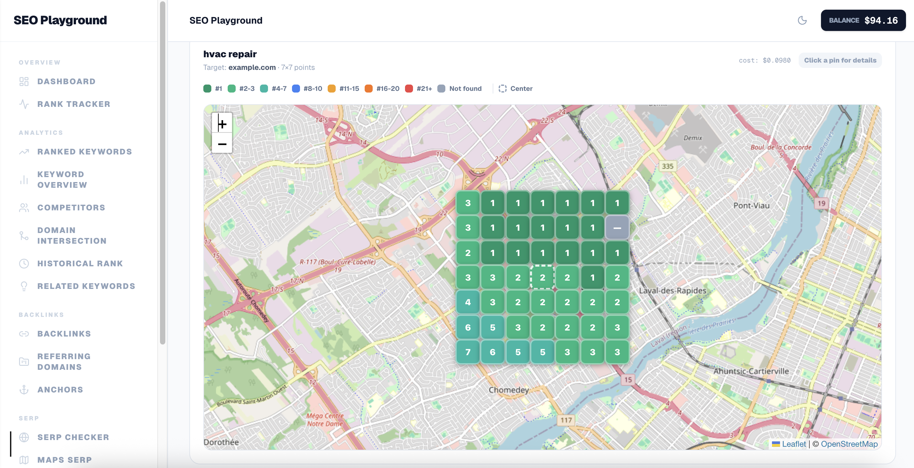
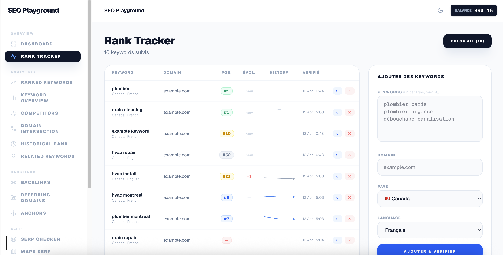
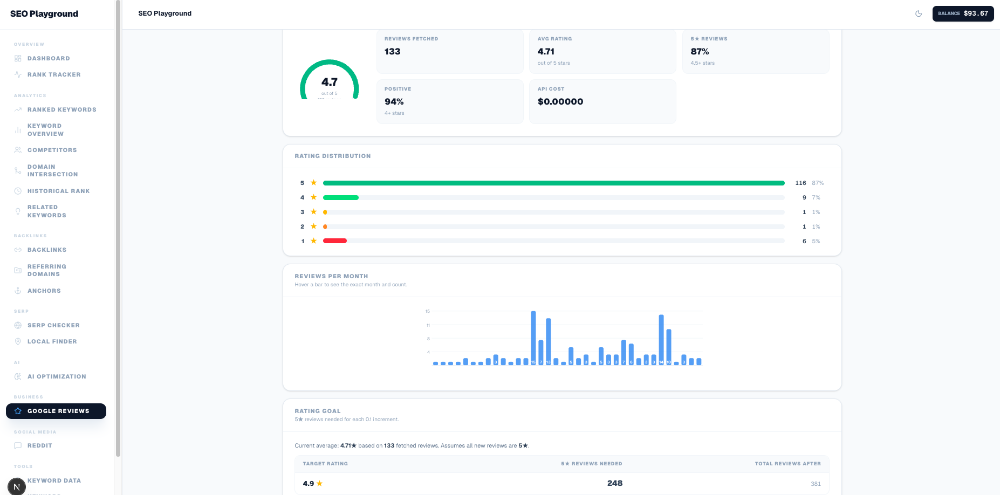

# SEO Playground — Local SEO Dashboard

> **New:** New AI Visibility page (see how often a domain/brand is mentioned by LLMs, and who dominates a topic). Nearly every results table across the app is now sortable and has a "Copy as Markdown" button. Searches on ~35 pages no longer get re-billed on accidental double-submits. See the [changelog](#changelog) below.

> **Work in progress** — new DataForSEO endpoints are being added progressively.

SEO Playground is a self-hosted dashboard that lets you run SEO and local SEO queries directly against the [DataForSEO API](https://dataforseo.com/). Every search is saved locally in a SQLite database, so you can browse your history and revisit results without making additional API calls. There is no cloud infrastructure involved — everything runs on your machine.

If you find this useful, consider supporting the project:

[](https://www.buymeacoffee.com/paulmassendari)
[](https://ko-fi.com/paulmassendari)

## Screenshots


*Local Finder: grid search showing local rankings across a geographic area*


*Rank Tracker: monitor keyword positions over time for any domain*


*Google Reviews: rating distribution, monthly review chart, and rating goal calculator*

## Features

- **Rank Tracker** — Track keyword positions over time for any domain
- **SERP Checker** — Analyze Google organic results with target domain highlighting
- **Ranked Keywords** — Discover what keywords a domain ranks for
- **Keyword Overview** — Metrics (volume, CPC, competition) for a list of keywords
- **Keyword Data** — Google Ads & Bing keyword research
- **Keyword Difficulty** — Bulk difficulty scores via DataForSEO Labs
- **Keyword Ideas** — Keyword ideas from a seed with volume, difficulty and intent
- **Search Intent** — Classify keywords by search intent (informational, navigational, commercial, transactional)
- **Related Keywords** — Related keyword suggestions from a seed keyword
- **Competitors** — Find competing domains in the SERPs
- **Domain Intersection** — Common keywords between two domains
- **Historical Rank** — Ranking history overview for a domain
- **Domain Categories** — Thematic categories for any domain
- **Subdomains** — Top subdomains by organic traffic
- **Traffic Estimation** — Bulk organic traffic estimate for a list of domains
- **Page Intersection (Labs)** — Keywords shared between multiple pages
- **Backlinks** — Full backlink profile: list, referring domains, anchors, referring networks, history
- **Backlinks Page Intersection** — Pages linking to multiple of your targets simultaneously
- **Backlinks Domain Intersection** — Domains linking to you and a competitor
- **Bulk Backlinks / Bulk Referring Domains** — Aggregated backlink metrics for a domain list
- **Local Finder** — Google local pack results for any keyword and location, with map-based coordinate picker
- **Geo-Grid Ranking** — Local visibility heatmap across a configurable grid of points (3×3 to 11×11). Choose between three API modes: Live (~6 s, instant results), Priority (~1 min, 40% cheaper) or Standard (background queue, 70% cheaper). Results are color-coded by rank position and saved locally for later review. Includes a competitive landscape panel (top competitors by grid presence, with a one-click "view on grid" toggle) and a visibility-by-distance breakdown.
- **On-Page Site Audit** — Full site crawl with pages, links, resources, duplicate tags and non-indexable pages
- **On-Page Instant Pages** — Instant single-page audit without crawling
- **Microdata Analysis** — Structured data inspection for any crawled URL
- **Content Parsing** — Quality score, readability (ARI), word count, meta tags, content blocks
- **Google Reviews** — Fetch and analyze Google Business reviews: rating distribution, monthly chart, and rating goal calculator
- **AI Optimization** — Visibility in AI-generated answers
- **AI Visibility** — Target overview (mentions, AI search volume, source/platform breakdown) or topic leaderboard (top mentioned domains and brands) via DataForSEO LLM Mentions
- **Reddit Mentions** — Discover Reddit threads linking to or discussing your URLs
- **Top Searches** — Local search trends
- **Settings** — Store your DataForSEO credentials and defaults locally

## Requirements

- Node.js 18+
- A [DataForSEO](https://dataforseo.com/) account (API key)

## Getting Started

### Option 1 — Docker (recommended)

The easiest and fastest way to run the app. Docker builds a production image so the app is fully optimized.

```bash
# Build and start (first run)
docker compose up --build

# Subsequent runs
docker compose up
```

The database is persisted in `./data/seo-playground.db` on your machine.

### Option 2 — Node.js (production mode)

Faster than dev mode — build once, then run.

```bash
npm install
npm run build
npm start
```

### Option 3 — Node.js (dev mode)

Convenient for development but noticeably slower — Next.js recompiles on every request and skips all optimizations. Not recommended for daily use.

```bash
npm install
npm run dev
```

Open [http://localhost:3000](http://localhost:3000) and go to **Settings** to enter your DataForSEO API credentials.

## Configuration

All settings (API credentials, default location, language, coordinates, domain) are stored locally in `seo-playground.db` (SQLite). No `.env` file is needed — configure everything from the Settings page.

## Data Storage

Search history and results are cached locally in `seo-playground.db`. The database is created automatically on first run.

## Tech Stack

- [Next.js 15](https://nextjs.org/) — App Router, Server Actions
- [React 19](https://react.dev/)
- [Tailwind CSS v4](https://tailwindcss.com/)
- [better-sqlite3](https://github.com/WiseLibs/better-sqlite3) — local SQLite storage
- [Leaflet](https://leafletjs.com/) — maps
- [Lucide React](https://lucide.dev/) — icons

## Changelog

### 2026-08-09

- **Location field restricted to supported countries on DataForSEO Labs / AI Optimization pages** — Related Keywords, Keyword Ideas, Keyword Overview, Ranked Keywords, Search Intent, Subdomains, Top Searches, Competitors, Domain/Page Intersection, Historical Rank, Domain Categories, Keyword Difficulty, Traffic Estimation, AI Keyword Data, and AI Optimization only ever accept country-level targeting (verified against DataForSEO's own `locations_and_languages` reference endpoint — no region/city ever works there); the location picker on those pages now only offers the ~94 countries that actually work, instead of the full city/region dataset that silently failed
- **Domain Categories now shows real category names** — was rendering raw numeric category codes (e.g. `10008`); added a `dfs_categories` reference table (seeded from DataForSEO's `categories` endpoint) and resolves each code to its full breadcrumb path (e.g. "Health > Health Conditions & Concerns")
- **Fix Bulk Backlinks showing empty New/Lost/Ref. Domains/Ref. IPs/Spam columns** — `backlinks/bulk_backlinks/live` only ever returns `target` and `backlinks`; those columns could never populate. Removed them and linked to the dedicated Bulk Ref. Domains page for that data instead
- **Keyword Ideas table is now sortable** — click any column header (Keyword, KD, Volume, CPC, Intent, Competition, Ref. Domains) to sort
- **"Copy as Markdown" button** — added next to CSV export on Keyword Ideas, for pasting results straight into docs/notes
- **Fix repeated billing on double-submit/refresh** — Backlinks now reuses its result if the same search (domain + filters) runs again within 60 seconds, instead of re-querying and re-billing DataForSEO every time; same protection Geo-Grid already had. Cleaned up 28 pre-existing duplicate history rows caused by this gap
- **Backlinks — fixed remaining French strings** (sort options, filter label, stat card labels, table headers, error messages)
- **New: AI Visibility page** — "My domain/brand" mode (total mentions, AI search volume, breakdown by platform/location/source domains/brand entities via `llm_mentions/target_metrics`) and "Topic leaderboard" mode (top mentioned domains and top mentioned brands for a keyword topic, side by side, via `llm_mentions/top_mentioned_domains` and `top_mentioned_brands`)
- **Sortable tables + "Copy as Markdown" everywhere** — nearly every results table in the app (Backlinks and its 8 sub-pages, Competitors, Domain/Page Intersection, Domain Categories, Domain Technologies, Keyword Data/Difficulty/Overview, Ranked/Related Keywords, Search Intent, Subdomains, Top Searches, Traffic Estimation, Rank Tracker, all 5 Site Audit tabs (Pages, Keyword Density, Links, Resources, Non-Indexable), AI Keyword Data) now has click-to-sort column headers and a one-click "Copy as Markdown" button next to CSV export, for pasting straight into docs/notes
- **Fix repeated billing on double-submit/refresh, app-wide** — the same 60-second dedupe protection added to Backlinks now covers ~35 pages (Keyword Ideas, Ranked/Related Keywords, Competitors, Domain/Page Intersection, Subdomains, Top Searches, Traffic Estimation, SERP Checker, Reddit, Domain Technologies/Whois, AI Prompt Test, and all Backlinks sub-pages, among others); intentionally left out of task-based flows (Rank Tracker, Google Reviews, Site Audit) where each submission is a deliberate distinct action
- **Fixed remaining French UI strings** across Keyword Data, Keyword Difficulty, Ranked/Related Keywords, SERP Checker, Top Searches, and Competitors

### 2026-07-25

- **Geo-Grid competitive analysis** — new "Competitive landscape" panel (top 5 competitors by grid presence, visibility score, one-click "view on grid" highlight) and "Visibility by distance" ring breakdown
- **Geo-Grid cost/duration estimates** — live-updating estimated cost and duration shown on the Live/Priority/Standard mode buttons, scaled to grid size
- **Geo-Grid pending panel** — added elapsed time and estimated time remaining
- **Geo-Grid history** — now shows the exact launch time, not just the date
- **Fix Geo-Grid Live mode returning mostly empty results** — requests are now throttled (6 concurrent, 1 retry) to handle DataForSEO's slower response times, instead of firing the whole grid at once and silently dropping timeouts
- **Fix Geo-Grid Priority queue mode** — the `priority` field was never actually sent to DataForSEO; Priority now genuinely costs more and completes faster than Standard
- **Fix Geo-Grid Queue mode indicator** — mode badge, wait-time hint, and poll interval were silently broken due to a value mismatch; polling could fire almost continuously instead of every 10–30s
- **Fix Geo-Grid Queue mode cost tracking** — final cost could be undercounted to $0.00 on multi-poll completions; points are now accumulated incrementally and never re-queried

### 2026-06-01

- **Local Finder simplified** — grid search removed from Local Finder and now lives exclusively in its own dedicated Geo-Grid Ranking page
- **Geo-Grid highlighted** — three queue modes (Live / Priority / Standard), grid sizes from 3×3 to 11×11, color-coded heatmap, auto-polling, local history
- **README: run options clarified** — Docker and `npm run build && npm start` recommended over `npm run dev`; dev mode noted as slow by design (no optimization, recompiles on every request)
- **Next.js dev indicator removed** — `devIndicators: false`

### 2026-05-31

- **Fix Labs API field mappings** — corrected response parsing for Keyword Ideas (`keyword_properties.keyword_difficulty`, flat structure with no `keyword_data` wrapper), Search Intent (`keyword_intent.label` and `secondary_keyword_intents` array), Subdomains (removed unsupported `order_by` parameter), and Traffic Estimation (removed non-existent position columns, added Paid KWs column)
- **Fix Keyword Ideas request** — endpoint requires `keywords` as an array, not a single `keyword` string
- **Remove Next.js dev indicator** — `devIndicators: false` in next.config.ts
- **Update banner translated to English**
- **Keyword Difficulty** — fixed remaining French strings

### 2026-05-30

- **Labs endpoints** — added Keyword Ideas, Search Intent, Page Intersection, Subdomains, Traffic Estimation
- **Domain Analytics** — added Categories page
- **OnPage** — added Site Audit tabs: Links, Resources, Duplicate Tags, Non-Indexable; added Content Parsing standalone page
- **Backlinks** — added Referring Networks, Page Intersection, Domain Intersection, History (with sparkline charts), Bulk Backlinks, Bulk Referring Domains
- **Fix microdata `field.value.join is not a function`** — DataForSEO returns `value` and `types` as strings in some responses; added `Array.isArray()` guards
- **Fix microdata "page not submitted"** — URL mismatch due to redirect normalization; fetch actual crawled URL from `on_page/pages` first
- **Docker support** — added Dockerfile, `.dockerignore`, and `docker-compose.yml` with persistent SQLite volume
- **Auto-refresh** — Site Audit page polls automatically while a crawl is in progress
- **UI redesign** — sidebar overhaul (blue active state, readable nav labels, section grouping), header cleanup, smooth scroll, focus rings
- **All UI text translated to English**

### Earlier

- **Google Reviews** — async task flow, rating distribution, monthly chart, rating goal calculator
- **On-Page Instant Pages** — full single-page audit via DataForSEO live endpoint
- **Geo-Grid Ranking** — heatmap across a geographic grid, async task polling
- **Site Audit fixes** — resolved INSERT OR REPLACE data wipe bug and invalid `order_by` parameter causing crawls to never complete
- **Initial release** — Rank Tracker, SERP Checker, Ranked Keywords, Keyword Overview, Keyword Data, Keyword Difficulty, Related Keywords, Competitors, Domain Intersection, Historical Rank, Backlinks, Local Finder, On-Page, AI Optimization, Reddit, Top Searches

## License

MIT
