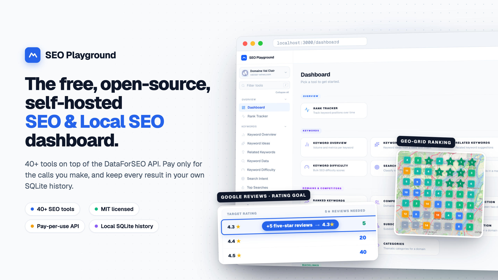
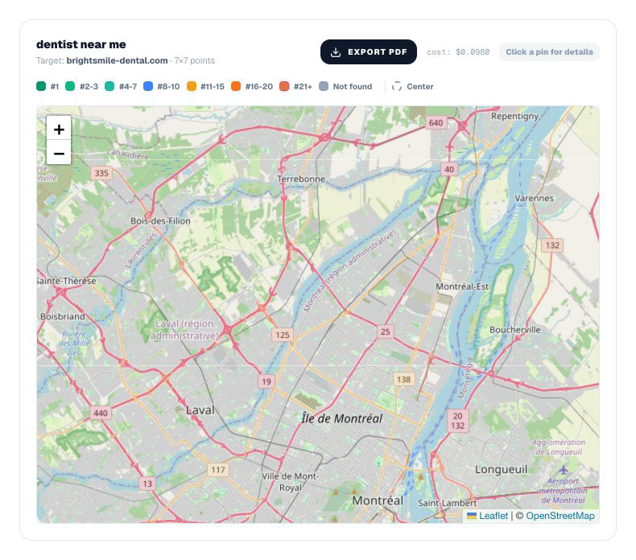
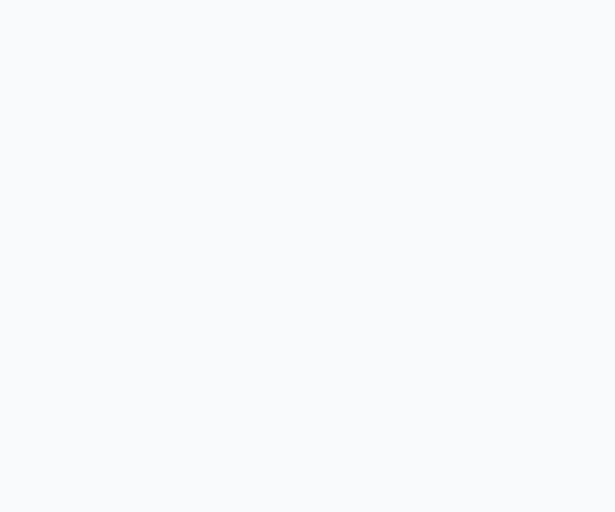

# SEO Playground — SEO and Local SEO Dashboard



## ✨ Update — v0.5.0

SEO Playground is actively evolving. Here are the latest substantial additions:

- 🔐 **Optional login (email + password)** — off by default, so a local install works exactly as before. Set `AUTH_ENABLED=true` to protect the whole dashboard and its API before putting it online: the first visit creates your account, then registration closes. No external service needed; it works with Docker and Node. See [Login (optional)](#login-optional).
- 🧭 **Prompt Tracker** — save the prompts your audience asks AI assistants, then re-run them on demand or every day to see whether ChatGPT, Claude, Gemini or Perplexity mention your brand or domain. Each check keeps the answer, the cited sources and its cost, and each prompt shows its mention rate over time.
- 🏷️ **White-label reports** — in Settings, brand every PDF with your own name, logo, report colour and header style (straight or wavy bar). The footer has its own text and colours, and e-mail addresses or domains in it become clickable links. A live preview shows the result before you save.
- 📄 **PDF exports across the app** — Site Audit, Google Reviews, AI Visibility, Geo-grid and Prompt Tracker all export branded PDF reports, with the same header and footer settings everywhere.
- 🗂️ **Multi-project workspace** — switch between clients or sites in one click. Each project has its own defaults, search history, results, and Rank Tracker depth.
- 📍 **Geo-grid monitoring, not just one-off maps** — save keyword/location monitors, browse a timeline of snapshots, compare movement point by point, inspect visibility trends, and schedule daily or weekly checks.
- ⏰ **Background tracking that keeps working** — scheduled Geo-grid and Rank Tracker runs continue without an open browser tab; a task center keeps their progress visible while you work elsewhere.
- 📄 **Client-ready exports** — generate branded PDF reports for Site Audit, Google Reviews, AI Visibility, and Geo-grid results, plus Excel exports for Site Audit and AI Visibility.
- 🧠 **Richer AI visibility analysis** — explore LLM mentions by platform, location, language, source domain, and brand entity; export target, topic-leaderboard, and historical views.
- 🚀 **Safer self-hosted releases** — deploy immutable, multi-architecture Docker images with version-aware update notices and a production Compose setup.

See the full [changelog](#changelog) for every improvement, fix, and release note.

> **Work in progress** — new DataForSEO endpoints are being added progressively.

SEO Playground is a self-hosted dashboard that lets you run SEO and local SEO queries directly against the [DataForSEO API](https://dataforseo.com/). Every search is saved locally in a SQLite database, so you can browse your history and revisit results without making additional API calls. There is no cloud infrastructure involved — everything runs on your machine.

If you find this useful, consider supporting the project:

[](https://www.buymeacoffee.com/paulmassendari)
[](https://ko-fi.com/paulmassendari)

New to DataForSEO? [Create an account through my affiliate link](https://try.dataforseo.com/nrjev32kinaz). It also supports the continued development of SEO Playground, at no extra cost to you. I may earn a commission if you become a customer.

## Screenshots

https://github.com/user-attachments/assets/fb506723-0996-4704-a6a5-b12b1115b805

*A quick tour of the dashboard and its 40+ tools (click to play the video)*



*Geo-grid: see where a business ranks block by block, then switch to any competitor's grid*


*Google Reviews: rating distribution, and exactly how many 5★ reviews it takes to reach the next rating*


*Web Mentions: sentiment, emotions, top domains and countries, plus every mention found across the web*

## Features

- **Rank Tracker** — Track keyword positions over time for any domain
- **Spending** — What your DataForSEO calls cost over any date range, per day and per tool, with calls of unknown cost counted separately and estimated
- **SERP Checker** — Analyze Google organic results with target domain highlighting
- **Ranked Keywords** — Discover what keywords a domain ranks for
- **Keyword Overview** — Metrics (volume, CPC, competition) for a list of keywords
- **Keyword Data** — Google Ads & Bing keyword research
- **Keyword Difficulty** — Bulk difficulty scores via DataForSEO Labs
- **Keyword Ideas** — Keyword ideas from a seed with volume, difficulty and intent
- **Search Intent** — Classify keywords by search intent (informational, navigational, commercial, transactional)
- **Related Keywords** — Related keyword suggestions from a seed keyword
- **Competitors** — Find competing domains in the SERPs
- **Domain Intersection** — Common keywords between two domains
- **Historical Rank** — Ranking history overview for a domain
- **Domain Categories** — Thematic categories for any domain
- **Subdomains** — Top subdomains by organic traffic
- **Traffic Estimation** — Bulk organic traffic estimate for a list of domains
- **Page Intersection (Labs)** — Keywords shared between multiple pages
- **Backlinks** — Full backlink profile: list, referring domains, anchors, referring networks, history
- **Backlinks Page Intersection** — Pages linking to multiple of your targets simultaneously
- **Backlinks Domain Intersection** — Domains linking to you and a competitor
- **Bulk Backlinks / Bulk Referring Domains** — Aggregated backlink metrics for a domain list
- **Local Finder** — Google local pack results for any keyword and location, with map-based coordinate picker
- **Geo-Grid Ranking** — Local visibility heatmap across a configurable grid of points (3×3 to 11×11), with a timeline of snapshots and point-by-point movement against the previous run. Choose between three API modes: Live (~6 s, instant results), Priority (~1 min, 40% cheaper) or Standard (background queue, 70% cheaper). A grid can be scheduled daily or weekly.
- **On-Page Site Audit** — Full site crawl with pages, links, resources, duplicate tags and non-indexable pages
- **On-Page Instant Pages** — Instant single-page audit without crawling
- **Microdata Analysis** — Structured data inspection for any crawled URL
- **Content Parsing** — Quality score, readability (ARI), word count, meta tags, content blocks
- **Google Reviews** — Fetch and analyze Google Business reviews: rating distribution, monthly chart, and rating goal calculator
- **AI Optimization** — Visibility in AI-generated answers
- **AI Visibility** — Target overview (mentions, AI search volume, source/platform breakdown) or topic leaderboard (top mentioned domains and brands) via DataForSEO LLM Mentions
- **Top Searches** — Local search trends
- **Prompt Tracker** — Track whether AI assistants (ChatGPT, Claude, Gemini, Perplexity) mention your brand or domain for saved prompts, with on-demand or daily checks, cited sources, a mention calendar and PDF/Markdown exports
- **AI Prompt Test** — See the live answer, cited sources and cost of any prompt on ChatGPT, Claude, Gemini or Perplexity
- **PDF reports and Excel exports** — Branded PDF reports for Site Audit, Google Reviews, AI Visibility, Geo-grid and Prompt Tracker, plus Excel exports for Site Audit and AI Visibility
- **Settings** — Store your DataForSEO credentials and a white-label report identity locally: brand name, logo, report colour, straight or wavy header, and footer text and colours

## Requirements

- Docker with Docker Compose
- Or Node.js 18+
- A DataForSEO account (API key). Don't have one yet? [Sign up through my affiliate link](https://try.dataforseo.com/nrjev32kinaz): it supports SEO Playground at no extra cost to you (I may earn a commission).

## Getting Started

### Option 1 — Docker with the published image (recommended)

The simplest install: no clone and no build. One file runs the released image (built for `amd64` and `arm64`) and starts both the dashboard and the Geo-grid worker.

```bash
mkdir seo-playground && cd seo-playground
curl -fsSLO https://github.com/paulmassen/seo-playground/releases/latest/download/docker-compose.production.yml
docker compose -f docker-compose.production.yml up -d
```

Open [http://localhost:3000](http://localhost:3000), then enter your DataForSEO credentials in **Settings**. Your data lives in the `seo-playground-data` Docker volume, which is kept across restarts and updates.

The downloaded file is pinned to the exact release it was published with, so the app never changes version behind your back. Do not use the floating `latest` image tag for a long-running install.

Optional settings (port, network access, login) go in a `.env` file next to it. [`.env.example`](.env.example) lists them all, for example:

```bash
SEO_PLAYGROUND_PORT=8080
AUTH_ENABLED=true
```

Run `docker compose -f docker-compose.production.yml up -d` again to apply them. Useful commands:

```bash
# Follow the dashboard and worker logs
docker compose -f docker-compose.production.yml logs -f

# Stop the services without deleting your data
docker compose -f docker-compose.production.yml down
```

**Network access:** both Compose files publish the dashboard on `127.0.0.1` only. By default SEO Playground has no login, and anyone who can reach it can spend your DataForSEO credit. To reach it from another machine, either turn on the built-in [login](#login-optional) (`AUTH_ENABLED=true`, optional and off by default) or put a reverse proxy with authentication in front of it (Coolify, Caddy, Traefik…). On a trusted private network only, you can listen on every interface with `SEO_PLAYGROUND_BIND=0.0.0.0`.

**Coolify, Yunohost and other hosts:** deploy the same Compose file, or use the image `ghcr.io/paulmassen/seo-playground` with an exact version tag (for example `0.5.0`). **Cloudron:** a community app package is available, see [cloudron/README.md](cloudron/README.md).

### Updating a release installation

The dashboard checks GitHub Releases twice a day and shows a notice when a newer stable release is available. It never updates itself.

1. Read the release notes linked from the notice, and back up the `seo-playground-data` volume.
2. From your install folder, download the new Compose file, then pull the image and restart:

   ```bash
   curl -fsSLO https://github.com/paulmassen/seo-playground/releases/latest/download/docker-compose.production.yml
   docker compose -f docker-compose.production.yml pull
   docker compose -f docker-compose.production.yml up -d
   ```

3. Confirm the dashboard loads and the Geo-grid worker is healthy with `docker compose -f docker-compose.production.yml logs -f`.

If your `.env` sets `SEO_PLAYGROUND_VERSION`, it overrides the downloaded file: change it to the new version too, or remove it. On Coolify, change the image tag to the announced version and redeploy.

### Option 2 — Docker from source

To run the current `main` branch or your own changes. The image is built on your machine.

```bash
git clone https://github.com/paulmassen/seo-playground.git && cd seo-playground
docker compose up -d --build
```

Open [http://localhost:3000](http://localhost:3000). The database and the worker secret are persisted in `./data/`. To update, run `git pull`, then `docker compose up -d --build` again.

**Linux:** the container runs as uid/gid `1000` by default so it can write to `./data`. If your user has a different uid (check with `id -u`), start it with:

```bash
HOST_UID=$(id -u) HOST_GID=$(id -g) docker compose up -d --build
```

### Option 3 — Node.js (production mode)

For a local server without Docker. This single command compiles the application, then starts the dashboard and worker together.

```bash
npm install
npm run launch
```

After a code update, run `npm run launch` again. If the app is already built, `npm start` starts both processes without rebuilding.

Node launches (`dev`, `start`, `launch`) listen on `127.0.0.1` by default. To deliberately expose the server, export `SEO_PLAYGROUND_BIND=0.0.0.0` before launching, and enable login or an authenticated reverse proxy first. `HOSTNAME` does not override this safety default.

### Option 4 — Node.js (dev mode)

Convenient for development but noticeably slower — Next.js recompiles on every request and skips all optimizations. Not recommended for daily use.

```bash
npm install
npm run dev
```

Open [http://localhost:3000](http://localhost:3000) and go to **Settings** to enter your DataForSEO API credentials.

## Testing

```bash
npm test
```

Runs the Vitest suite (dedupe/cache helpers). No DataForSEO credentials or network access needed — it uses a throwaway SQLite file.

## Publishing a stable release

Stable releases are published from versioned tags, not from `main`. Set the new version in `package.json`, `CHANGELOG.md` and the `SEO_PLAYGROUND_VERSION` default of `docker-compose.production.yml`, verify the application locally, then create and push a matching tag:

```bash
RELEASE_TAG=vX.Y.Z npm run check:release   # checks package.json, the Compose default and a "## [X.Y.Z]" CHANGELOG section
git tag vX.Y.Z
git push origin vX.Y.Z
```

The `Publish stable release` workflow verifies that the tag matches `package.json`, runs lint/tests/build, publishes the `amd64` and `arm64` images to GHCR, generates a provenance attestation, then creates the GitHub Release using that version's CHANGELOG.md section as its notes, with `docker-compose.production.yml` attached for the install and update commands above. Mark the GHCR package public once in GitHub package settings so self-hosted users can pull it anonymously.

## Configuration

API credentials and report identity are stored locally in `seo-playground.db` (SQLite). Search defaults are configured per project. No `.env` file is needed — configure credentials from the Settings page.

### Scheduled Geo-grid checks

Schedules are configured from a Geo-grid timeline. The application always runs two lightweight processes:

- the **web app**, which serves the dashboard;
- the **Geo-grid worker**, which starts due snapshots and retrieves completed DataForSEO queue tasks.

This means scheduled checks work with no browser tab open and no external cron configuration. The worker makes one internal request per minute by default; it has negligible CPU usage between checks.

```bash
# Node.js — build, then start both processes
npm run launch

# Docker — build and start both services
docker compose up -d
```

`npm run dev` also starts both processes for development. In Node mode, the launcher creates a private in-memory worker secret. In Docker mode, Compose creates a private secret file in `data/` on first launch. You do not need to configure either secret yourself.

| Variable | Default | Purpose |
| --- | --- | --- |
| `GEO_GRID_WORKER_INTERVAL_MS` | `60000` | Worker check interval in milliseconds (minimum: 10 seconds). |
| `PORT` | `3000` | Dashboard port in Node mode. The launcher passes the same port to the worker. |
| `CRON_SECRET` | generated automatically | Optional override for the internal worker authentication secret. |

For example, to check every two minutes in Docker:

```bash
GEO_GRID_WORKER_INTERVAL_MS=120000 docker compose up -d
```

The schedule uses the browser timezone that created it, including daylight-saving changes.

### Login (optional)

**Login is optional and disabled by default.** Without `AUTH_ENABLED=true` nothing changes: no login page, no account, no extra files — the right choice on `localhost` or behind your own authentication (reverse proxy, VPN). Before putting the dashboard online, turn on the built-in email and password login:

```bash
# .env next to docker-compose.yml (Docker) or exported before `npm run launch` (Node)
AUTH_ENABLED=true
BETTER_AUTH_URL=https://seo.example.com   # the public URL; use http://... or leave unset on a LAN
```

To deploy online, in this order: (1) set the variables above and start the app, still reachable only from `127.0.0.1`; (2) open it and create your account; (3) only then expose it, behind HTTPS. To turn the login off again, remove `AUTH_ENABLED` (your accounts stay in the `.auth` file for later).

Open the dashboard: the first visit shows **Create your account**. That is the only account — registration closes as soon as it exists, so create it right after deploying (the default Docker setup only listens on `127.0.0.1` until you expose it). After that, every page and `/api` route requires a signed-in session. Sign out with the icon at the top right.

- Accounts and sessions live in `seo-playground.db.auth` next to the main database, with the signing secret in `seo-playground.db.auth-secret` (set `BETTER_AUTH_SECRET` to manage it yourself). Back both files up with your data.
- Passwords are hashed (scrypt), at least 10 characters, and sign-in attempts are rate-limited.
- The Geo-grid worker is unaffected: `/api/cron` keeps its own private secret.
- Serve it over **HTTPS** (Caddy, Traefik, a Cloudflare Tunnel…). Passwords are sent as-is to the server, so plain http is only suitable for a trusted network. An `https://` `BETTER_AUTH_URL` marks the session cookie `Secure`.
- Forgot the password? Stop the app and delete `seo-playground.db.auth*`; the next visit shows the setup page again. Your SEO data is not touched.

| Variable | Default | Purpose |
| --- | --- | --- |
| `AUTH_ENABLED` | off | `true` turns the login on. |
| `BETTER_AUTH_URL` | derived from the request | Public URL of the dashboard; required behind a reverse proxy. |
| `BETTER_AUTH_SECRET` | generated automatically | Optional override for the session signing secret. |

## Data Storage

Search history and results are cached locally in `seo-playground.db`. The database is created automatically on first run.

## Tech Stack

- [Next.js 15](https://nextjs.org/) — App Router, Server Actions
- [React 19](https://react.dev/)
- [Tailwind CSS v4](https://tailwindcss.com/)
- [better-sqlite3](https://github.com/WiseLibs/better-sqlite3) — local SQLite storage
- [Leaflet](https://leafletjs.com/) — maps
- [Lucide React](https://lucide.dev/) — icons

## Changelog

Full detailed history: [CHANGELOG.md](CHANGELOG.md).

- **2026-10-09 — v0.5.0** — Optional email + password login (`AUTH_ENABLED=true`). Cloudron community app package. Searches, checks and settings changes always save to the project they started in, even if you switch projects meanwhile. Node launches listen on `127.0.0.1` by default (`SEO_PLAYGROUND_BIND` to override). OpenStreetMap maps work behind strict proxies. **Prompt Tracker** (`/dashboard/prompt-tracker`): save prompts and re-run them on demand or daily to check brand/domain mentions in ChatGPT, Claude, Gemini and Perplexity answers, with stored answers, sources and costs, a mention calendar, and PDF/Markdown exports. **White-label reports**: Settings now control the brand name, an uploaded PNG/JPEG logo, the report colour, a straight or wavy header, and the footer text, background, text and link colours; the same identity applies to Site Audit, Google Reviews, AI Visibility, Geo-grid and Prompt Tracker PDFs. Geo-grid PDFs no longer overflow their competitor table, and logos keep their proportions. Rank Tracker shows AI Overview citations and the top 10 of each check. AI Prompt Test offers every DataForSEO model, with a default per platform.
- **2026-10-01** — Rank Tracker checks stop crawling once the domain is found (lower cost per check), flag AI Overview citations with an "AI" badge, and show "Not found" with the last known position. Fixed Site Audit's word count and its Keyword Density, Duplicate Tags and Non-indexable tabs. Switching projects from the project switcher now keeps you on the current page instead of returning to the dashboard home.
- **2026-09-28 — v0.4.0** — First versioned release, published as a multi-architecture Docker image on GHCR. Multi-project workspace (per-project defaults, history and schedules). Scheduled Geo-grid (daily/weekly) and Rank Tracker (daily) checks run by a background worker with no browser tab open, plus a task center for queued runs. Geo-grid snapshot timeline, comparison map and trend. PDF reports and Excel exports. Rank Tracker checks of several keywords at once fixed. Both Compose files now listen on `127.0.0.1` only by default, since the dashboard has no login.

- **2026-09-16** — Geo-Grid: points where you rank #1 now show as a bulky rounded star instead of a square, so first-place coverage stands out; the grid center keeps a white halo.
- **2026-09-15** — Fixed Domain Intersection and Page Intersection (both failed with `Invalid Field: 'targets'`): requests now use DataForSEO's `targets: {"1": …, "2": …}` format and the nested per-target response is mapped correctly. API errors that reject the whole request now show DataForSEO's real message instead of "Empty API response". Removed the Reddit Mentions page: DataForSEO has disabled that endpoint (`50304 — function temporarily unavailable`). Docker on native Linux: fixed every page returning 500 (`SQLITE_CANTOPEN`) because the container user couldn't write to the `./data` bind mount, and the image now ships the locations/categories CSVs, which were never seeded in Docker. Competitors, Ranked Keywords, SERP Checker and Keyword Data now pre-fill the Default Location/Language saved in Settings instead of always using France/French ([#8](https://github.com/paulmassen/seo-playground/issues/8)). SERP Checker now records and shows what each search cost ([#9](https://github.com/paulmassen/seo-playground/issues/9)). New Spending page: spend per day/month and per tool for any date range (presets or custom), built from the cost saved by every tool; calls with no recorded cost are counted separately and estimated at the tool's average rather than treated as $0. Sidebar reorganized by task (Keywords, Domains & Competitors, Backlinks, SERP & Local, AI, Business, Site Audit) with collapsible sections whose open/closed state is remembered, a tool filter (press `/` to focus, Enter opens the first match), and Spending/Settings pinned at the bottom; the Balance badge links to Spending. The Dashboard home now uses the same tool list as the sidebar (it was missing AI Visibility, AI Prompt Test, AI Keyword Data, Query Fan-Out, Web Mentions and Content Parsing).
- **2026-08-30** — New Web Mentions page (brand sentiment monitoring via DataForSEO Content Analysis API). New "Trend over time" mode on AI Visibility (month-by-month mentions/volume via `llm_mentions/historical`). App-wide audit: added the first automated test suite (`npm test`, Vitest), fixed AI Optimization page missing caching/dedupe (was re-billing on every refresh), `db.ts` migrations swallowing real errors (not just "column already exists"), migrated ~40 pages onto a new shared `callDataForSeo()` API helper (uniform auth/error handling, catching a few real bugs along the way: SERP Checker and Domain Intersection silently swallowing API errors, Reddit and Content Parsing with no `try/catch` around their fetch), and closed the remaining dark mode gaps across ~30 files (Local Finder, Google Reviews, Keyword Data/Difficulty/Overview, Related/Ranked Keywords, Domain Intersection, Competitors, Rank Tracker, Backlinks, Reddit, OnPage, SERP Checker, AI Optimization) — every dashboard page is now fully dark-mode aware.
- **2026-08-09** — New Query Fan-Out page (hidden AI sub-queries + their search volume). New AI Visibility page (LLM mention tracking). Sortable tables + "Copy as Markdown" across ~30 pages. Fixed location targeting on Labs pages, Domain Categories names, Bulk Backlinks columns, repeated billing on double-submits app-wide, and blank "Related queries" pills on AI Optimization.
- **2026-07-25** — Geo-Grid competitive analysis (top competitors, visibility-by-distance) and several Geo-Grid reliability/cost-tracking fixes.
- **2026-06-01** — Geo-Grid Ranking split out into its own dedicated page.
- **2026-05-31 and earlier** — Labs endpoint field-mapping fixes, Docker support, UI redesign, initial release of core rank tracking, keyword research, backlinks, and on-page features.

## License

MIT
